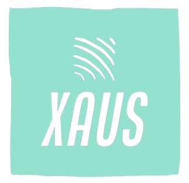

   

### Tópicos 

- [Descrição do projeto](#Descrição-do-projeto)

- [Funcionalidades](#Funcionalidades)

- [Ferramentas utilizadas](#Ferramentas-utilizadas)

- [Desenvolvedor](#Desenvolvedor)

## Descrição do projeto 

 O XAUS fornece um painel intuitivo baseado em admin panel para gerenciar todos os aspectos cruciais de um negócio, desde a criação de pedidos até a administração de usuários e permissões. 
  Ele é construído com foco na segurança, escalabilidade e facilidade de manutenção.

## Funcionalidades

:white_check_mark: `Funcionalidade 1:` Criar pedidos, produtos, e clientes 

:white_check_mark: `Funcionalidade 2:` Criar usuários que possam ser autenticados com jwt token (Spring security)

:white_check_mark: `Funcionalidade 3:` Definir cargos e permissões para cada usuário  

:white_check_mark: `Funcionalidade 4:` Dashboard para visualização do resumo mensal 

:white_check_mark: `Funcionalidade 5:` Migrations para manter o banco de dados versionado (FlyWay)

:white_check_mark: `Funcionalidade 6:` Envio de email com token para redefinição de senha (Thymeleaf(HTML) e Jakarta Mail)    

:white_check_mark: `Funcionalidade 7:` Notificações de novos pedidos para o empacotador e admin (Websockets e RabbitMq) 

:white_check_mark: `Funcionalidade 8:` Criação de testes unitários para melhor mantenabilidade

:white_check_mark: `Funcionalidade 9:` Implementação de cache compartilhado permitindo escalabilidade entre multiplas instâncias (Docker e Redis)  

## Ferramentas-utilizadas

***FRONT-END***

&nbsp;
&nbsp;
&nbsp;
&nbsp;
&nbsp;
&nbsp;
&nbsp;

***BACK-END***

&nbsp;
&nbsp;
&nbsp;
&nbsp;
&nbsp;
&nbsp;
&nbsp;

***INFRA***

&nbsp;
&nbsp;
&nbsp;

## Desenvolvedor

[ Murilo Barbosa](https://github.com/Murilo358) 
